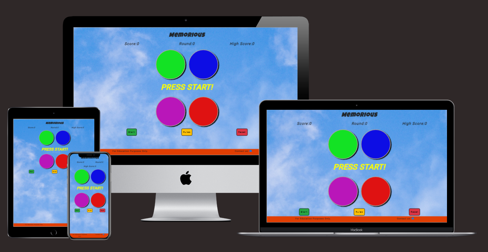

# MEMORIOUS

[Click here for the live site](https://bradders81.github.io/ms2-memory-game/)

A Simon style memory game.  The aim of the game it to try and beat your high score.

____

## Description

Memorious is a memory game based on the popular iconic game from the 70's, Simon. There are four coloured buttons, which the game will flash in a sequence. The user must remember the sequence and copy the sequence to progress to the next round.  Round 1 just has 1 light flash.  Round 2 has 2 lights flash.  Round 3 has 3 lights flash and so on.  In each round the sequence is the same as the last round and the button flashed is added at random.  There are an infinite number of rounds and the aim of the game is to see how far you can go and then attempt to beat your own high score.  As such, the game naturally gets harder as the user gets better at remembering the sequence.  
____

## User Stories

*"I want a simple game that I can play when I have a spare moment"*  
*"I want a game that keeps me challenged"*  
*"I want a game that is fun"*  
*"I want to be able to contact the site owner if I have a question"*
____

## UX

### **Strategy**

#### Owner

* Wants to create a game that is fun.

* Create a game that keeps the user challenged.

#### User

* Wants a game that is fun.

* To be able to find and understand the rules.

* A game that keeps me challenge.

### **Scope**

This project will:

* Be a one page site.;

* Have game buttons in the middle, with instruction in between.;

* Have a button to a modal with the rules.;

* Have a start and a reset button.;

* Counters to keep track of, score, high score and the round.;

### **Structure**

My initial idea was to create the game in a Star Wars theme and I had started to do research online for structure and layout.  However, not everyone is a Star Wars fan, so I decided to go for a more generic theme with bright cheerful colours.

The game will be on a one page site and on mobile devices it is designed to be played portrait mode.  Depending on the size of the mobile device, the user would be able hold their phone and play this game using only one hand.

I settled on the name Memorious, which means having an unusually good memory, as I thought this was a fitting title for this game.  

The layout will be kept simple and intuitive and easy to understand for the user.

The site will have a small footer with contact details.

The site will be built using HTML, CSS JavaScript and JQuery.  The majority of the site will be built using JavaScript.

When building the site I will initially create the basic layout using HTML and CSS.  This will be to simply put the elements in the right place whilst I write the JavaScript for the games functionality, as this will take up most of my time.  Once bulk of the JavaScript is written I will then look to complete the styling.

### **Skeleton**

As stated above this is a one page site.  In mobile view I planned to have the score and round counters stack on top of each other, but this was pushing the other elements down too far, so I changed the grid system so that only the high score counter moves down a row.  Whilst this is only a small change, for completeness I have updated the wireframes.  I have included both wireframes in one .pdf document for the ease of comparison.

[Click here for wireframes the sites wireframes](assets/docs/wireframes.pdf)

### **Surface**

The background image will be an image of the sky and the colours of the 4 game buttons will be green, blue, purple and red.  The control buttons (start, rules and reset) will be green, yellow and red.  The control buttons will be created using Bootstrap, as will the modal with the rules.  I did consider having a separate page with the rules, but this would have required navigation to be included in the site.  The rules could also have been fixed on the page, but I decided that having the rules pop-up in a modal would be more efficient and a better use of the screen real estate.

The font families used for this project are Luckiest Guy, cursive  for the h1 heading and Roboto, sans-serif for the rest of the site.  I did intend to use Dela Gothic One for the h1 but I noticed on testing that the font was not loading on mobile devices, so I switched it to Luckiest Guy.

#### **Mockup**

____

## Future Features

Advertising: as the game grows in popularity, then this might open up opportunities to provide space for advertisements in order to generate revenue.

Leader board: table of the top ten plays, to encourage competition between users.

____

## Technologies

* **HTML** - Used for the main body structure.
* **CSS** - For the styling of site.
* **JavaScript** - Used for to create the functionality of the game.
* [JQuery](https://jquery.com/) - Used alongside JavaScript to create the functionality of the game.
* [Bootstrap](https://getbootstrap.com/) - Used for the modal, start, rules and reset buttons.  Also used for the Bootstrap grid system to help make the site responsive.
* [Google Fonts](https://fonts.google.com/) - For all the fonts used in this site.
* [FontAwesome](https://fontawesome.com/) - Used to provide the email icon in the footer.
* [Favicon Generator](https://favicon.io/favicon-converter/) - used to create favicon ico file from the background image: bg1.jpg
* [Techsini](http://techsini.com/multi-mockup/index.php) - Used to create the Mockup.
* [balsamiq](https://balsamiq.com/)-For wireframes.
* [Gitpod](https://www.gitpod.io/) - Within the Integrated Development Environment (IDE) used in this project. Gitpod extensions used: Auto Close Tag; Bootstrap 4CDN Snippet for boilerplate and head; HTML Hint; Prettier; Color Picker; Indent-Rainbow; and Code Spell Checker.
* [Git](https://git-scm.com/) - version control technology used in ths project.
* [GitHub](http://github.com/) - Stores repositories and is updated via commits sent to it via Git. Also used to deploy the site to GitHub Pages
* [GitHub Pages](https://pages.github.com/) - Hosts the live site.
* [Google Chrome Developer Tools](https://developers.google.com/web/tools/chrome-devtools) - Used to debug and test the site throughout development.
* [FreeFormatter.com](https://www.freeformatter.com/html-formatter.html) - To make sure code indents and is easy to read.
* [CSS Beautifier](http://minifycode.com/css-beautifier/) - To make sure code is easy to read.

____

## Testing

[Click here for testing information](assets/docs/testing.md)

____

## Deployment

The site is created using Gitpod (IDE) and the site documentation is contained within a repository in GitHub.  The repository can be found [here](https://github.com/Bradders81/ms2-memory-game)

The files, documents were sent to GitHub from Gitpod, by using the Git software with the following commands

* git add *file(s)* name
* git commit -m "commit description"
* git push

The site is hosted in GitHub Pages and the following process can be used to deploy the project to a live site (which is the process I used)

1. Log into GitHub
1. From within the [repository](https://github.com/Bradders81/ms2-memory-game) click the settings (next to insights)
1. From within settings scroll down the page to 'GitHub Pages' section
1. Within that section select the branch to be deployed (master is recommended)
1. Click Save.
1. The site will then be deployed to git hub pages and you will be provided with a web address.

### Cloning The Site

1. From within the repository click on 'Code' button with the download icon.
1. A small menu will appear to give you various options.  One option is to copy the URL provided in this menu.
1. Within the Integrated Development Environment (IDE) that you are using, change the directory to the ULR you have just copied.
1. For more options and details as to how to clone the site click [here](https://docs.github.com/en/free-pro-team@latest/github/using-git/which-remote-url-should-i-use) You may need to be logged into GitHub to view this page.

____

## Credits

### Images

[Background image](https://unsplash.com/@duo1ze) Obtained from Unsplash, by Duo1ze.

### Sound

[Beep1](https://freesound.org/people/peepholecircus/sounds/196979/) from Freesound, by Peepholecircus.

[Beep2](https://freesound.org/people/solernix/sounds/540902/) from Freesound, by solemix.

[Beep3](https://freesound.org/people/solernix/sounds/540902/) from Freesound, by ZvinbergsA.

[Beep4](https://freesound.org/people/shukran/sounds) from Freesound,  by shukran.

## General Credits

**Bootstrap** has been used to create the grid system, the modal, start and reset buttons, these have however, been customised by me using CSS.

**Google Fonts:**  As noted above, the fonts for this project are from Google Fonts.  The import at the top of the CSS file was copied from Google Fonts.

**Mail Icon:** The email icon in the footer is from FontAwesome.

The idea of putting all my JavaScript code inside a DOMContentLoaded event listener was taken from a tutorial I watched on making a card pairs memory game on YouTube by YouTuber, Ania Kubow.  The link to the video is [here](https://www.youtube.com/watch?v=tjyDOHzKN0w).  

The code/syntax on line 1 of my script.js file i.e. document.addEventListener("DOMContentLoaded", () => {  is taken from that video.

The code used for the sticky footer was taken from [CSS-Trick](https://css-tricks.com/couple-takes-sticky-footer/#there-is-flexbox), in an Article by Chris Coyier.  The article provides five ways to create a sticky footer.  I used the option headed 'There is a flex'

The jQuery method/syntax for disabling and enabling the button in the game was learned from [Use JQuery](https://usejquery.com/jquery/enable-disable-button-jquery/).

## Acknowledgements

Thanks go to:

* My mentor, Ignatius Ukwuoma for his continued  advice and feedback.

* The Code Institute Slack Community who are always on hand to answer queries.

* The Code Institute Tutors for their assistance with any queries.
