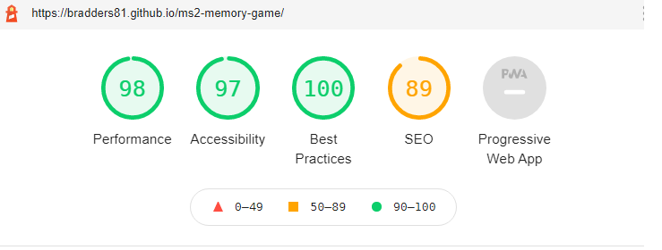
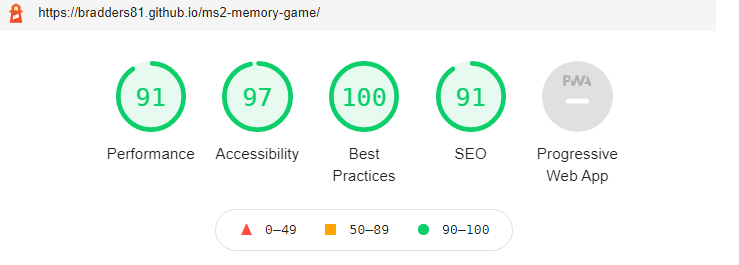

# TESTING

Throughout the creation of the game I used Chrome DevTools, console.log and alert() to test the Javascript Code. This was especially useful when creating the more larger functions in the JavaScript file.

## Testing HTML AND CSS Code In Validators

1. **HTML** - Tested with [W3C Validation Service](https://validator.w3.org/) - PASSED No errors or warnings. Click [here](html-validator.png) to see the result.

1. **CSS** - Tested with [W3C CSS Validation Service](https://jigsaw.w3.org/css-validator/#validate_by_input) = PASSED No errors or warnings.  Click [here](css-validator.png) to see the result. For this test instead of using the live sites URL I had to copy the code from my style.css file direct into the validator. This is because the Bootstrap CDN was causing errors. I researched this online and it is due to how some of the Bootstrap code in written so that it is still recognised by older browsers. If you want to read further information about this on the Bootstrap website, click [here](https://getbootstrap.com/docs/4.0/getting-started/browsers-devices/#validators).

## Passing JavaScript Code Through Jshint

Used Jshint to look for major errors. As a result of this I spotted some tidying up. I added some ';' that were missing and added 'let' to some of the variables in the functions, so that they were not declared globally.

## User Stories

1. _"I want a simple game that I can play when I have a spare moment"_  
   PASS: the game is simple to play and does not take long to play. It could be played for example when having a short break at work or commuting.

1. _"I want a game that keeps me challenged"_
   PASS: The game keeps track of the user's high score. The user is challenged to beat their own high score, so the greater their high score, the more difficult the game becomes. The game has an infinite number of rounds.

1. _"I want a game that is fun"_
   PASS: I believe that the game is fun. In testing I have asked friends and family to play the game and they agree the game is fun.

1. _"I want to be able to contact the site owner if I have a question"_
   PASS: The site provides an email address in the footer so the user can contact the site owner.

## Functionality

1. The user should not be able to click any of the four game buttons before the game starts - PASS

1. The start button should start the game and ensure the user and game arrays are set to empty arrays - PASS

1. The user should not be able to press the start button again until the game has been reset - PASS

1. The user should not be able to click any of the game buttons when it is not their turn - PASS

1. The modal should pop up at the top of the page and be dismissed with the understand button - PASS

1. The reset button should reset the round and score counters, but not the high score counter - PASS

1. Clicking on the email icon in the footer should create an email in the users email software - PASS

## Responsive

PASS - The game is responsive on desktop, tablet and mobile devices.

## Dev Tools Lighthouse Test

This test was done on a windows laptop and using Chrome Browser in incognito mode, so that the test was not effected by any extensions installed.

### Desktop Result

### Mobile Result

___

# BUGS

## Unsolved

The site works on the various different devices I have used in Chrome Dev Tools. I have also tested the device in the real world and it works fine on both Android mobile and tablet platforms. I also tested the site on my iPhone 8 and the game lags from round 1 and crashes by the time it gets to round 3.

I have researched online for a solution for this but I cannot find one. I have also sought assistance from Code Institute Tutors, but we did not identify the cause. The Tutors have told me that iPhones are notorious for this bug. I have not been able to identify why this happens. I was advised by the Tutor to document the bug here.

## Solved

I had a major headache in trying get the for loop in the displayPattern function to complete before the function called the turnOn function. The turnOn would be called even if I called it after the for loop or put it in the checkMatch function.

At the point the displayPatten function is called the user cannot click. The turnOn function needs to be called after the for loop in the displayPatten function has completed, so the user can take their turn. If it is called before the user would be able to click the game buttons whilst the pattern is being displayed by the game.

I tried calling the turnOn function in different places and tried different methods and searched for a solution online.

In the end I solved the problem with the assistance of Code Institute Tutor Support.  The function was placed inside a timeout, with a timeout length of the gamePattern array, multiplied by 600 millisecond.  See line 88 of the script.js file.

This took some considerable time to fix, even with the help of Tutor Support.  However, having spent time researching this problem I gained a much better understanding of the order in which JavaScript Code is read/stacked in the browser.  This will put me in good stead for future projects of this type.
